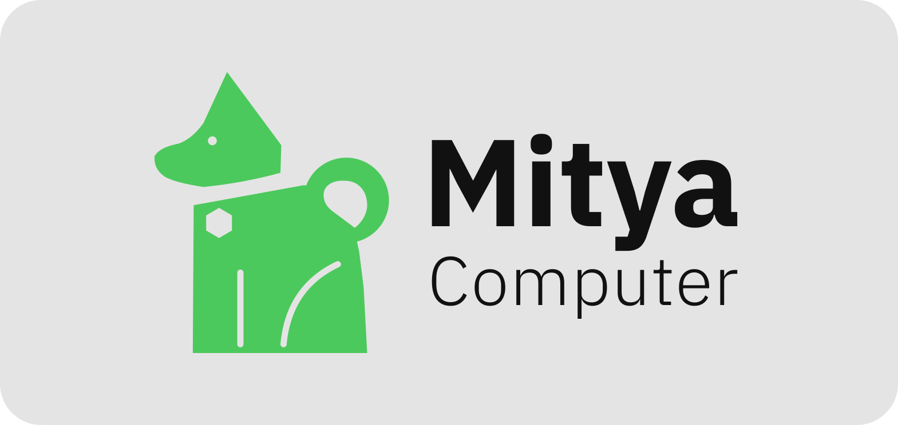
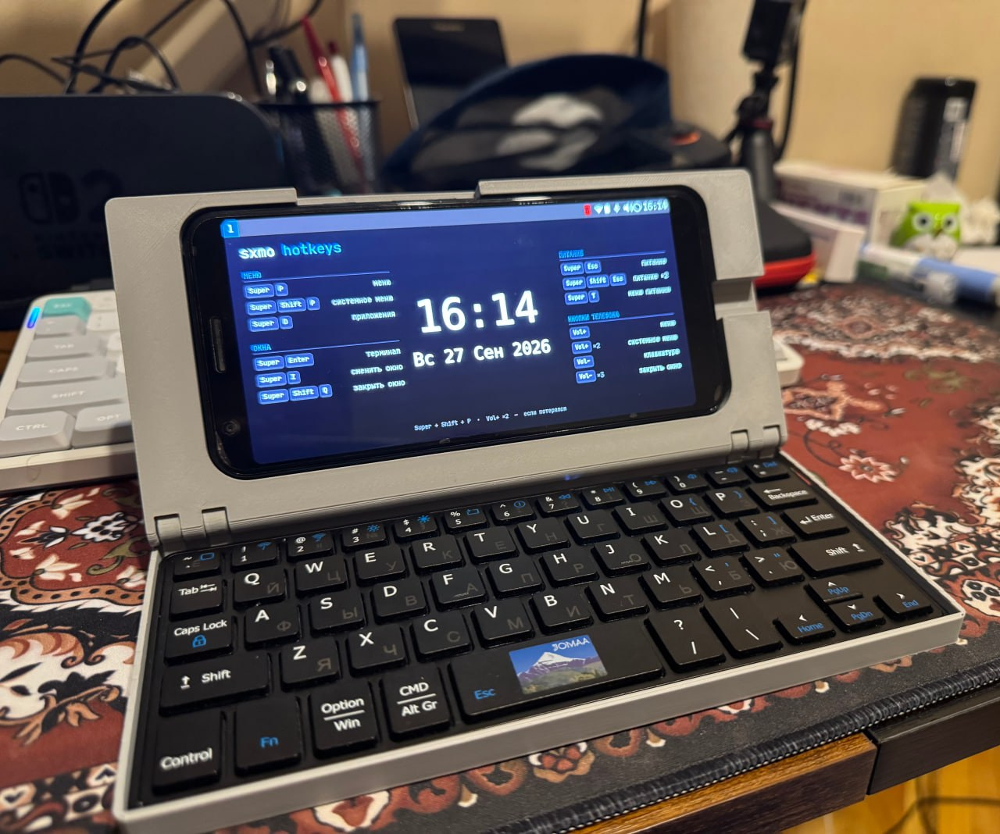
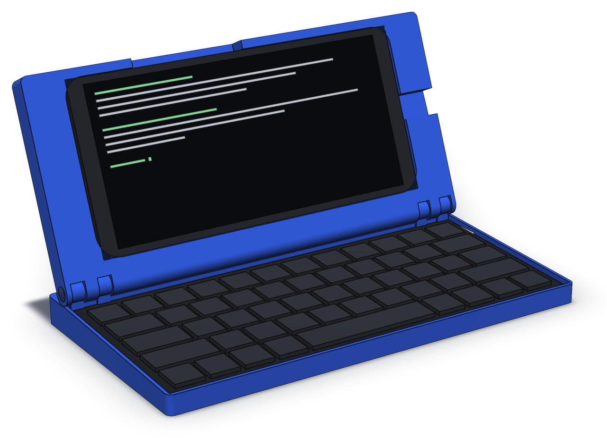
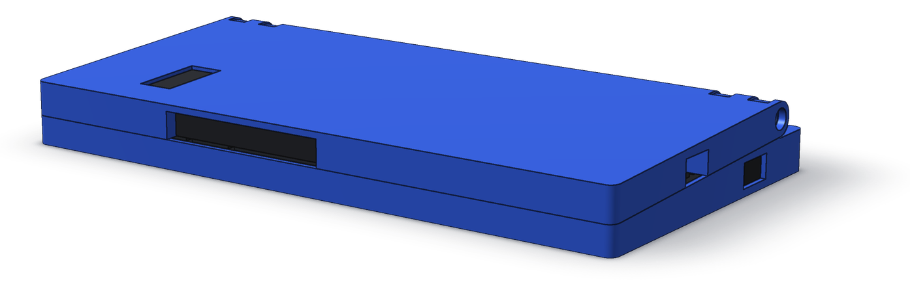

<p align="center">
  
</p>

<p align="center"><a href="README.md">English</a> · <b>Русский</b></p>

# Mitya Computer Skladen

Раскладушка, которая превращает Pixel 3a XL в карманный терминал в форме ноутбука.
Название — *складень*: дорожная икона на петлях, две створки, которые смыкаются
над тем, что в них лежит.

Это Mk3, третья итерация — после Mk1 (Blender) и Mk2 (FreeCAD), ни одна из
которых не публиковалась.

Телефон тот же, клавиатура новая — Jomaa KEYBOARD098RU, вынутая из чехла-книжки.

<p align="center">
  
  <br>
  <sub>Первая полная печать, работает Sxmo.</sub>
</p>

**Цель Mk3 — быть как можно тоньше.** Mk2 в сложенном виде около 32 мм;
расчётная толщина Mk3 — 22,2 мм, причём оба компонента полностью закрыты корпусом,
а клавиатура не вскрывается.

<p align="center">
  
  <br>
  
  <br>
  <sub>В закрытом виде: 23,24 мм у петли, 19,26 спереди. Оба рендера получены прямо из
  модели через <code>cad/render.py</code>; телефон и клавиатура — заглушки по их
  измеренным габаритам.</sub>
</p>

## Состояние

Измерено, просчитано, смоделировано, и теперь печатается. Геометрия — это код: `cad/`
собирает модель и сам сверяет её с расчётами. Первые напечатанные образцы
выявили два дефекта, которые не ловила ни одна проверка; теперь проверяются оба —
см. [ADR-0010](docs/adr/0010-hinge-station-count.md).

**Расчётная точка: 23,24 мм в закрытом виде сзади, 19,26 спереди** — клавиатура
представляет собой клин в 2,64°, поэтому и закрытое устройство — клин. Лишний
миллиметр сверх исходных 22,24 — это скотч за телефоном; см.
[ADR-0004](docs/adr/0004-phone-retention.md).

Документация пока только на английском.

| Документ | Что это |
|---|---|
| [requirements.md](docs/requirements.md) | Цели, ограничения, критерии приёмки |
| [measurements.md](docs/measurements.md) | Все размеры, с пометкой о достоверности |
| [analysis/thickness-budget.md](docs/analysis/thickness-budget.md) | Из чего складывается толщина в закрытом виде, и три сценария |
| [analysis/balance.md](docs/analysis/balance.md) | Опрокидывает ли его тяжёлая крышка и чего стоит это исправить |
| [analysis/clamshell-geometry.md](docs/analysis/clamshell-geometry.md) | Почему крышка мельче основания и хвост остаётся открытым |
| [plan.md](docs/plan.md) | Этапы, критический путь и пять названных рисков |
| [parameters.md](docs/parameters.md) | Все определяющие размеры, в паре с `cad/params.py` |
| [adr/](docs/adr/README.md) | Десять проектных решений: шесть приняты, одно отклонено, три открыты |

## Что выяснилось

**Ни один компонент тоньше не станет, поэтому пришлось убрать обшивки.** Корпус
клавиатуры — 9,52 мм, телефон — 8,2 мм; вместе это 90% бюджета, и ни то, ни другое
не обсуждается: [ADR-0002](docs/adr/0002-keyboard-integration-depth.md) оставляет
клавиатуру запечатанной и откладывает её разборку до Mk4. Оставались две обшивки
по 1,2 мм: задняя стенка крышки и дно основания. Удаление обеих и опускает
устройство ниже 20 мм.

**Обе обшивки сознательно потрачены на закрытый корпус.** Ни одна не была нужна
конструктивно: собственная нижняя крышка клавиатуры могла бы служить дном
основания (−1,2 мм), а собственная задняя крышка телефона — внешней стороной крышки
(−1,2 мм), что дало бы устройство толщиной 19,8 мм с открытыми компонентами.
[ADR-0008](docs/adr/0008-base-floor.md) и
[ADR-0004](docs/adr/0004-phone-retention.md) отказались от обоих вариантов. Итог —
22,24 мм с полностью закрытыми компонентами: на 30% тоньше Mk2 вместо 38%. Таков был
размен, и он оставляет лишь 0,26 мм запаса до текущего жёсткого предела, который
[нужно пересмотреть](docs/requirements.md#n1-needs-restating).

**Петля печатается, а не покупается.** Чтобы удерживать крышку, нужно
0,10–0,12 Н·м — самый низ диапазона серийных петель с моментом, где уменьшенная
серия Reell для бытовой электроники начинается с 0,11 Н·м. Напечатанные кулачки на
двух опорах со стяжкой M3 дают этот момент при прижиме 22–25 Н на каждой — для M3
это всё ещё лёгкая нагрузка. Главная идея: **болт задаёт деформацию, а упругая шайба
задаёт усилие**, поэтому момент регулируется отвёрткой и переживает ползучесть PETG.
Отдельные опоры, а не сквозной стержень во всю ширину, потому что сопротивление
перекосу даёт расстояние между крайними точками, а не непрерывность, — а печатный
цилиндр длиной 193 мм выгнулся бы. Две опоры, а не три, потому что болт можно
подвести к опоре только снаружи устройства: скруглённая задняя часть крышки идёт на
всю ширину вдоль оси петли, и к центральной опоре не было доступа
([ADR-0010](docs/adr/0010-hinge-station-count.md)). Ждать поставки не нужно, и это
убрало самый долгий пункт с критического пути. Покупные петли с моментом остаются
записанными как путь для апгрейда в [ADR-0005](docs/adr/0005-hinge-mechanism.md).

**Проблема опрокидывания решилась бесплатно.** Телефон (167 г) тяжелее клавиатуры
(95 г), и без поддержки устройство опрокидывается, если открыть его больше чем на 127°.
Полное решение — чтобы не опрокидывалось ни под каким углом — стоит 15 мм выноса
назад, а это ноль массы и ноль толщины; и именно на этих 15 мм стоят опоры петли.
Ничего похожего на солидный балласт, который подразумевает имя `palmtop_weighted`
у Mk2.

## Структура

```
docs/          требования, измерения, расчёты, ADR
docs/img/      фото для README и рендеры из cad/render.py
cad/           модель на build123d: её задаёт params.py, build.py проверяет и экспортирует
cad/logo/      исходная графика логотипа, из которой вырезаются вставки в крышку
export/device/    STL и STEP устройства: крышка + основание (нейлоновая гайка DIN 985)
export/plainnut/  основание под обычную гайку DIN 934 + фиксатор резьбы; крышка из device/
export/coupon21/  пробные образцы опор петли; на образце основания есть и паз выключателя
export/switch/    толкатель, переключающий выключатель клавиатуры с задней стороны,
                  три длины зубцов на пять длин стержня: печатаете набор, оставляете подходящий
export/logo/      логотип Mitya Computer: lid-logo (с выемкой) + зелёная вставка,
                  которая её заполняет, для печати двумя филаментами
export/drawings/  SVG-виды и сечения
```

## Лицензия

Copyright Dmitrii Trifonov 2026.

Проект — модель в `cad/`, экспортируемые из неё файлы и документация — распространяется
под [CERN Open Hardware Licence Version 2 – Strongly Reciprocal](LICENSE)
(CERN-OHL-S-2.0). По этой лицензии исходником проекта является Python-модель: если
вы её адаптируете — скажем, под другой телефон или клавиатуру — и распространяете
результат или что-либо сделанное по нему, вы делитесь изменённым исходником на тех же
условиях.

**Кроме названия и логотипа Mitya Computer.** Графика в `cad/logo/` и
`docs/img/mitya-computer.svg`, а также логотип, который из неё попадает в `export/logo/`,
под эту лицензию не подпадают: все права защищены. Они лежат в репозитории, чтобы
крышку можно было собрать с ними, а не для повторного использования. Устройство,
которое вы изготавливаете и распространяете по этому проекту, должно использовать
простую крышку из `export/device/`, без логотипа, или крышку со своим логотипом.

Этот перевод — для удобства; юридически значим английский текст лицензии.

Исходники: <https://github.com/DmitriiTrifonov/skladen>
